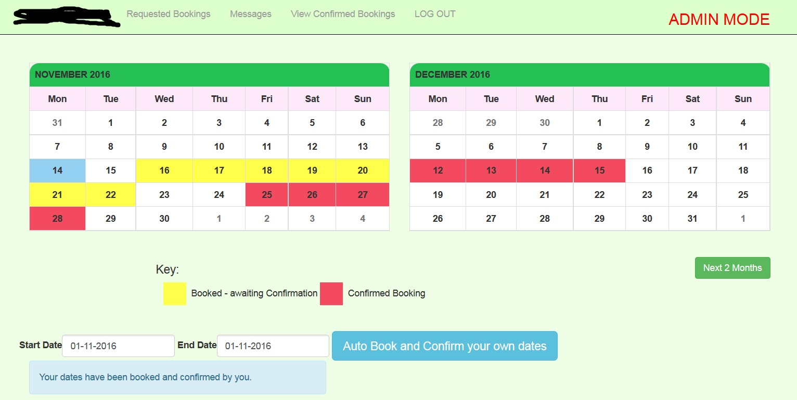
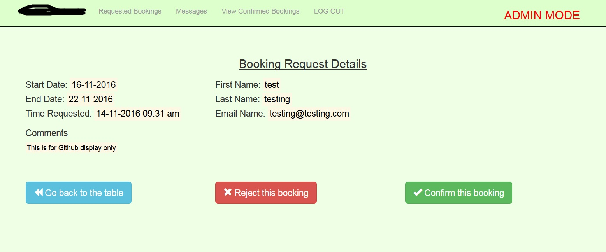

# Codeigniter-Auto-Book
Codeigniter 3: Complete Calendar Auto Booking System

Uses: Codeigniter version 3.0.6.
Requires: Bootstrap, Jquery, half-slider.css -included in this repo

Codeigniter Site that uses the CI Calendar to make a color coded booking system. Bookings are made fully automated by the framework. 

Public users can make bookings, which will auto update the site Calendar. Site admin can later confirm the bookings, changing the status of the bookings on the public view of the site. The Calendar auto updates to reflect any bookings made. This code will also prevent bookings from clashing from previous bookings made.

Code also includes a complete Admin system to deal with bookings in an efficient manner, as well as a messaging system from the public to the site admin. For example, this code can be used to advertise a rental property, and has the complete code to handle
booking enquiries.

NOTE: Code does not include CI system files. Pls integrate into your own CI framework. Also, Bootstrap files will be required, or update to use Boostrap CDN.

View of the Admin CI Calender. Same for the public side.

Demo view of dealing with a booking on the Admin side

